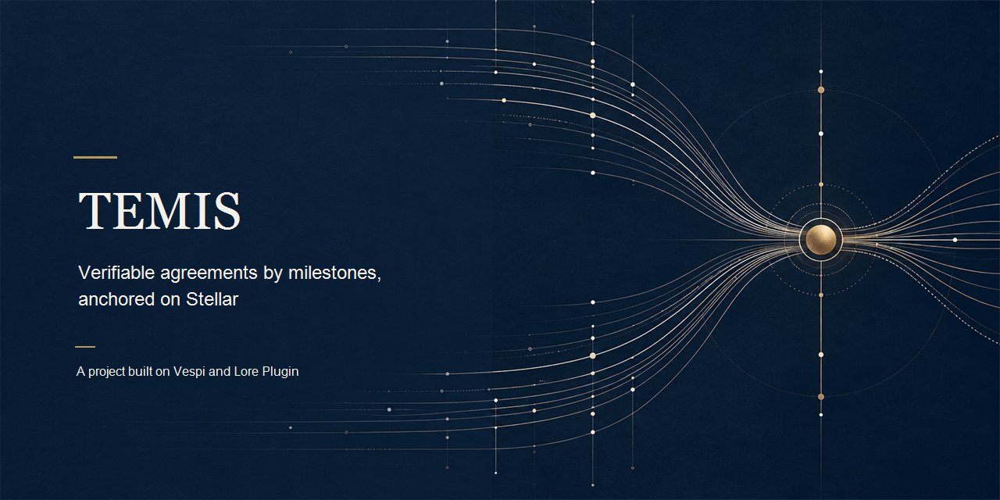

[](./assets/cover.png)

# TEMIS

<p align="center">
  <a href="#english"></a>
  <a href="./LICENSE"></a>
  <a href="./docs/EVIDENCE.md"></a>
  <a href="./docs/EVIDENCE.md"></a>
  <a href="https://github.com/andresanemic/lore-plugin"></a>
</p>

<p align="center"><b>TEMIS</b> — two people sign an agreement and later cannot tell who did what.<br>
Each party acts only within what it was allowed, and every step is checked and recorded. Evidence: 22/22 states rebuilt from Horizon. Fictional data on Stellar testnet.<br>
<b>TEMIS</b> — dos personas firman un acuerdo y después no saben quién cumplió qué.<br>
Cada parte actúa solo dentro de lo permitido, y cada paso se comprueba y queda registrado. Evidencia: 22/22 estados reconstruidos desde Horizon. Datos ficticios en Stellar testnet.</p>

<p align="center"><b>La unidad no es el contrato. La unidad es el hito, y lo que cada parte dejó registrado sobre él.</b></p>

<details>
<summary><b>Read in English</b></summary>

<a id="english"></a>

**A signed agreement does not record what happened next. TEMIS makes each milestone legible and lets a third party reconstruct the record.**

> **The unit is not the contract. The unit is the milestone, and what each party recorded about it.**

TEMIS is a validation layer for bilateral agreements arranged by milestones. Each party signs the same version digest; later declarations, responses, challenges and corrections become lines in an append-only record. The digest of each line is anchored in a classic Stellar transaction with `MEMO_HASH`. The agreement body and evidence stay off-chain. The anchor makes a record easier to inspect; it does not decide who is right.

## The problem

Most of the costly work starts after the signatures. One party remembers a request, another has a delivery receipt, and a third file contains the reply. When those records drift apart, reconstructing the sequence takes time and professional attention. A signed or notarized agreement can establish a document, but it does not keep the story of each obligation in one checkable sequence.

TEMIS starts from that gap. It gives an agreement a version, gives each milestone its own recorded path, and distinguishes a mutual confirmation from a one-sided statement. That distinction matters: a cryptographic record can make an account inspectable, but it cannot turn an unanswered claim into a shared fact.

## If you are judging Find Your Way or Meridian, start here

Read the project foundation and its walkthrough. Start with [How it works](./docs/HOW_IT_WORKS.md).

Open the test record. See [Evidence](./docs/EVIDENCE.md).

Read the legal and verification limits. See [Legal and limits](./docs/LEGAL_AND_LIMITS.md).

Review the publication conditions. See [Code not included](./CODE_NOT_INCLUDED.md) and the [review-only license](./LICENSE).

## In one minute

Imagine two people who agree that one will deliver a design package by a stated date and that the other will confirm receipt. They each keep a PDF and a folder of messages. If one goes quiet, the other can still say what happened, but the files do not show whether both parties agreed on the outcome.

In TEMIS, a legal professional prepares the agreement and its milestone. Both parties sign the same canonical version digest. The delivery, its evidence reference, a response and any correction are recorded as separate signed events. If both sign the close, the milestone can be `fulfilled`. If one party does not answer, the operator can record `fulfilled_unconfirmed`, a weaker status that remains visibly unconfirmed. A third party can compare the record against the public ledger history and an off-chain copy.

The design-package scenario is illustrative and uses fictional parties. It follows the documented workflow; it is not a real client record or a claim that the MVP has operated a legal service. The live evidence linked below is from separate fictional testnet runs.

## What it looks like in practice

The example below is a narrated reading of the documented path, not a transcript emitted by a TEMIS command. Names and materials are fictional. The terms in the record match the outcomes used by the specification and test receipts.

```text
Fictional case · two parties · one milestone

Agreement: delivery of a design package
Evidence required: delivery receipt
Version: both parties sign the same digest

Party A  → records a signed delivery statement
Party B  → accepts, challenges, or does not respond
```

If both parties confirm the close, the record can say:

```text
milestone: fulfilled
```

If the second party does not respond, the operator may record:

```text
milestone: fulfilled_unconfirmed
meaning: one party's declaration is recorded; the other did not confirm
```

Those snippets show the documented milestone labels, not raw terminal output. In a separate real testnet payment run with fictional data, the receipt reports one facilitator call and one credit of 0.01 USDC after a retry. The corresponding [Horizon transaction](https://horizon-testnet.stellar.org/transactions/5495a053cfde91f2ac2dd4eece581fc628072416cf9007d6ca78ab3becf4273a) is public. That payment demonstrates a technical x402 path; it is not a lawyer-marketplace payment or a client service.

## Why TEMIS

A notarized document and a milestone record answer different questions. TEMIS focuses on requests, declarations and replies that accumulate after the agreement is signed.

| You need | What it gives you | Where it lives |
|---|---|---|
| Both parties to refer to the same agreement version | TEMIS-CF-1 canonicalization and a SHA-256 digest signed by each party | [How it works](./docs/HOW_IT_WORKS.md#canonical-record-temis-cf-1) |
| A record that shows a missing response | Separate outcomes for `fulfilled` and `fulfilled_unconfirmed` | [Walkthrough](./docs/HOW_IT_WORKS.md#walkthrough-two-parties-and-one-milestone) |
| Corrections without erasing the earlier statement | Append-only lines; a correction identifies the line it annuls | [Chain rules](./docs/HOW_IT_WORKS.md#chain-rules) |
| A public reference for a line digest | Stellar transaction with `MEMO_HASH`; the document body stays private to the parties | [Evidence](./docs/EVIDENCE.md) |
| A payment retry that does not call the facilitator twice in the tested path | Durable payment facts keyed to the obligation, with uncertain cases surfaced for review | [x402 flow and limits](./docs/HOW_IT_WORKS.md#x402-payments-flow-table-guarantees-and-limits) |
| An outside reconstruction to compare with a party's copy | A third-party rebuild matched 22 of 22 statuses in one corrected run | [Reconstruction evidence](./docs/EVIDENCE.md#temis-agreement-lifecycle-and-independent-reconstruction) |

## How it works

```text
   Party A ── signs version digest ──┐
                                     ├─ same TEMIS-CF-1 digest
   Party B ─ countersigns version ───┘
                    │
                    ▼
      milestone events become signed lines
      declare · accept · challenge · correct · close
                    │
                    ▼
      line digest → Stellar MEMO_HASH anchor
                    │
                    ▼
      independent reviewer rebuilds and compares
      ledger history + specification + party copy
```

| Actor | Role and rights in the described design | What the record can show | Boundary |
|---|---|---|---|
| Parties A and B | Sign, declare, accept, challenge and keep their own copies | Which keys signed which digests, and in what recorded order | A key does not establish civil identity or free consent |
| Legal professional | Prepares or reviews the agreement and its milestones | The professional named in the agreement record | TEMIS does not replace legal work |
| TEMIS operator | Coordinates recording and anchors line digests | The anchor account's public write sequence | The operator is not a judge; one anchor account creates a key and trust risk |
| Technical verifier or provider | Compares supplied material or delivers a bounded paid capability | A match or mismatch for the supplied inputs and the related payment reference | It cannot certify truth, legal sufficiency or provider quality |
| Independent reviewer | Rebuilds the sequence from public history and compares a party copy | Whether the supplied record agrees with the rebuilt sequence | Needs the complete history, specification and copy |

The record format and payment flow are described in [How it works](./docs/HOW_IT_WORKS.md). An anchor proves that a digest appeared in a ledger transaction; it does not reveal the agreement body or verify its assertions.

## What TEMIS is not

TEMIS is not a judge, arbitrator, insurer, guarantor, DAO or operating lawyer marketplace. It does not decide truth, legal responsibility, identity, consent or admissibility. It does not enforce an obligation, collect a debt, pay for a breach or guarantee that either party will perform. A signature supports technical integrity and key control; it does not prove civil identity or free consent. A Stellar anchor is not an accredited legal timestamp.

## Evidence you can open

The receipts describe the MVP's tests 0 to 8 using fictional data on Stellar testnet. A corrected lifecycle run had 23 transactions, 22 with `MEMO_HASH`; an independent third-party reconstruction matched 22 of 22 recorded statuses and the outcomes of three milestones. That reviewer also found a defect in copy comparison when bodies were missing or altered. It was corrected and covered by tests. This is one reconstruction with published inputs, not a general reliability or legal finding.

The latest project receipt reports **153 tests and zero failures**. Earlier suite counts are historical sizes, not extra tests to add. This figure belongs to the project suite; it does not mean that every one of Vespi's ten functional projects currently passes against the latest kernel. Nine project suites were pinned to an earlier Vespi kernel digest and need a deliberate re-pin before their results apply to the newer kernel. The target kernel is now **0.1.5 release** (commit `ed559e8`); re-pin work remains pending after the release and requires a fresh project run. TEMIS's own reported suite result remains 153 tests, zero failures.

The testnet receipts also record a muxed `payTo` rejected at `/verify`, a comparison between `payment` and `invoke_host_function` operations, one idempotent x402 payment, and three rounds of competing anchors. Limits are part of the evidence: the muxed payment was not sent to `/settle`; the idempotency scenario used one facilitator and one payer; and a late settlement conflict is detected for human reconciliation, not prevented. The full hashes and conditions are in [Evidence](./docs/EVIDENCE.md).

## The lawyer model and the token

TEMIS grows from the Not Ponzi concept: the lawyer prepares an agreement without hourly billing, receives a small percentage if it is fulfilled and assumes the cost of defending the client if it is breached. In that proposed arrangement, the lawyer behaves like the client's insurer by taking on risk. TEMIS itself is not an insurer and does not promise coverage. If an arrangement like this qualifies as insurance under Chile's DFL 251, a lawyer must review it. The public material is not a legal opinion.

The product direction is a marketplace, a “Tinder for lawyers”: people and lawyers would match, agree on services and pay. That marketplace has not been built. $TEMIS is a testnet proof of concept for one possible payment method; USDC or XLM could also be used. The testnet asset has no price, sale, liquidity or promised value. RUC-D puts tokenomics last, after institutional relations, resources, actors and rights, rules, verification and architecture. See [Token](./docs/TOKEN.md).

## TEMIS, Vespi and Lore Plugin

[Lore Plugin](https://github.com/andresanemic/lore-plugin) supplies project criteria and the coordinator’s method; TEMIS was built with that method, and its agreement and criterion live in the project. TEMIS does **not** run on the [Vespi](https://github.com/andresanemic/vespi) kernel: its append-only record, signatures, TEMIS-CF-1 canonical form, milestone states and Stellar testnet anchors are TEMIS’s own code, and its source says so. The kernel was read as a design reference (the project’s step-zero notes cite it by file and line), and TEMIS uses the same public x402 packages that Vespi’s x402 reference bridge uses; neither makes TEMIS a consumer of the kernel’s operations, authority or receipts. Whether TEMIS should consume the kernel’s receipts and pubnet-pending anchors is an open decision that the current suite does not exercise.

## What is not built or verified

There is no mainnet operation, live legal service, lawyer marketplace, market demand study, multi-facilitator operation or production readiness claim. The reconstruction covers one run; it did not verify the authenticity of Stellar transaction signatures. The testnet proof does not cover the case where service delivery succeeds and settlement then fails, and the testnet scenarios for `uncertain` and `conflict` are not substitutes for every timing race. The independent evidence and remaining cases are listed in [Evidence](./docs/EVIDENCE.md).

The token study does not establish a market, price, liquidity, investment value or legal classification. The Chilean legal analysis has not been reviewed by a competent lawyer. See [Legal and limits](./docs/LEGAL_AND_LIMITS.md).

## How to review this project

This public repository contains documentation, testnet evidence, token records and a review-only [LICENSE](./LICENSE), not source code. [Code not included](./CODE_NOT_INCLUDED.md) explains the planned opening during the judging period and the conditions for reading and cloning for evaluation. The license is proprietary, is not OSI-approved and remains a working draft for lawyer review.

## Author

**Andrés Peña Mellado**, Digital Art Director & Creative Developer working across AI agents, Web3, design and research. Repository authority: `andresanemic`.

[](https://t.me/andresanemic) &nbsp;&nbsp; [<picture><source media="(prefers-color-scheme: dark)" srcset="./assets/icons/v2/x-dark.svg"></picture>](https://x.com/andresanemic) &nbsp;&nbsp; [](https://www.linkedin.com/in/andresanemic/)

---

[How it works](./docs/HOW_IT_WORKS.md) · [Evidence](./docs/EVIDENCE.md) · [Token](./docs/TOKEN.md) · [Legal and limits](./docs/LEGAL_AND_LIMITS.md) · [Code not included](./CODE_NOT_INCLUDED.md) · [Review-only license](./LICENSE) · [Vespi](https://github.com/andresanemic/vespi) · [Lore Plugin](https://github.com/andresanemic/lore-plugin)

</details>

<details>
<summary><b>Leer en español</b></summary>

<a id="espanol"></a>

**Un acuerdo firmado no registra lo que ocurre después. TEMIS hace visible cada hito y permite que un tercero reconstruya el registro.**

> **La unidad no es el contrato. La unidad es el hito, y lo que cada parte registró sobre él.**

TEMIS es una capa de validación para acuerdos bilaterales organizados por hitos. Cada parte firma el digest de la misma versión; las declaraciones, respuestas, impugnaciones y correcciones posteriores se agregan como líneas a un registro. El digest de cada línea se ancla en una transacción clásica de Stellar con `MEMO_HASH`. El cuerpo del acuerdo y la evidencia quedan fuera de la cadena. El anclaje facilita inspeccionar un registro; no decide quién tiene razón.

## El problema

Gran parte del trabajo costoso empieza después de las firmas. Una parte recuerda una solicitud, otra conserva un comprobante de entrega y un tercer archivo contiene la respuesta. Cuando esos registros se separan, reconstruir la secuencia requiere tiempo y atención profesional. Un acuerdo firmado o notarizado puede acreditar un documento, pero no mantiene en una secuencia comprobable el relato de cada obligación.

TEMIS parte de esa brecha. Asigna una versión al acuerdo, da a cada hito su propio recorrido registrado y distingue la confirmación mutua de una declaración unilateral. La diferencia importa: un registro criptográfico puede hacer inspeccionable un relato, pero no transforma una afirmación sin respuesta en un hecho compartido.

## Si estás evaluando Find Your Way o Meridian, empieza aquí

Lee la base del proyecto y su recorrido. Empieza por [Cómo funciona](./docs/HOW_IT_WORKS.md).

Abre el registro de pruebas. Consulta [Evidencia](./docs/EVIDENCE.md).

Lee los límites jurídicos y de verificación. Consulta [Marco legal y límites](./docs/LEGAL_AND_LIMITS.md).

Revisa las condiciones de publicación. Consulta [Código no incluido](./CODE_NOT_INCLUDED.md) y la [licencia de solo revisión](./LICENSE).

## En un minuto

Imagina a dos personas que acuerdan que una entregará un paquete de diseño en una fecha y que la otra confirmará la recepción. Cada una conserva un PDF y una carpeta de mensajes. Si una deja de responder, la otra todavía puede contar lo que ocurrió, pero los archivos no muestran si ambas acordaron el resultado.

En TEMIS, una persona abogada prepara el acuerdo y sus hitos. Ambas partes firman el mismo digest de versión canónica. La entrega, su referencia de evidencia, una respuesta y cualquier corrección quedan registradas como eventos firmados separados. Si ambas firman el cierre, el hito puede quedar como `fulfilled`. Si una no responde, el operador puede registrar `fulfilled_unconfirmed`, un estado más débil que permanece visiblemente sin confirmar. Un tercero puede comparar el registro con el historial público del ledger y una copia fuera de la cadena.

El caso del paquete de diseño es ilustrativo y usa partes ficticias. Sigue el recorrido documentado; no describe un cliente real ni afirma que el MVP haya prestado un servicio jurídico. La evidencia real enlazada más abajo proviene de corridas separadas en testnet con datos de fantasía.

## Cómo se ve en la práctica

El ejemplo siguiente es una lectura narrada del recorrido documentado, no una transcripción emitida por un comando de TEMIS. Los nombres y materiales son ficticios. Los términos del registro coinciden con los estados usados por la especificación y los recibos de prueba.

```text
Caso ficticio · dos partes · un hito

Acuerdo: entrega de un paquete de diseño
Evidencia exigida: comprobante de entrega
Versión: ambas partes firman el mismo digest

Parte A  → registra una declaración de entrega firmada
Parte B  → acepta, impugna o no responde
```

Si ambas partes confirman el cierre, el registro puede indicar:

```text
hito: fulfilled
```

Si la segunda parte no responde, el operador puede registrar:

```text
hito: fulfilled_unconfirmed
significado: consta la declaración de una parte; la otra no confirmó
```

Estos fragmentos muestran las etiquetas documentadas para los hitos, no la salida cruda de una terminal. En una corrida real de pago x402 en testnet con datos de fantasía, el recibo informa una llamada al facilitador y un abono de 0,01 USDC después de un reintento. La [transacción de Horizon](https://horizon-testnet.stellar.org/transactions/5495a053cfde91f2ac2dd4eece581fc628072416cf9007d6ca78ab3becf4273a) es pública. Ese pago demuestra un recorrido técnico x402; no es un pago de un marketplace de abogados ni un servicio a un cliente.

## Por qué TEMIS

Un documento notarizado y un registro de hitos responden preguntas distintas. TEMIS se concentra en las solicitudes, declaraciones y respuestas que se acumulan después de firmar el acuerdo.

| Necesitas | Qué te da | Dónde vive |
|---|---|---|
| Que ambas partes consulten la misma versión del acuerdo | Canonicalización TEMIS-CF-1 y un digest SHA-256 firmado por cada parte | [Cómo funciona](./docs/HOW_IT_WORKS.md#registro-canónico-temis-cf-1) |
| Que el registro muestre una respuesta ausente | Estados distintos para `fulfilled` y `fulfilled_unconfirmed` | [Recorrido](./docs/HOW_IT_WORKS.md#recorrido-dos-partes-y-un-hito) |
| Corregir sin borrar la declaración anterior | Líneas de solo anexado; la corrección identifica la línea que anula | [Reglas de la cadena](./docs/HOW_IT_WORKS.md#reglas-de-la-cadena) |
| Una referencia pública para el digest de una línea | Transacción de Stellar con `MEMO_HASH`; el cuerpo del documento queda con las partes | [Evidencia](./docs/EVIDENCE.md) |
| Reintentar un pago sin llamar dos veces al facilitador en el recorrido probado | Hechos de pago durables asociados a la obligación; los casos inciertos quedan visibles para revisión | [Recorrido y límites de x402](./docs/HOW_IT_WORKS.md#pagos-x402-recorrido-tabla-garantías-y-límites) |
| Una reconstrucción externa para comparar con la copia de una parte | Un tercero coincidió en 22 de 22 estatus en una corrida corregida | [Evidencia de reconstrucción](./docs/EVIDENCE.md#ciclo-del-acuerdo-y-reconstrucción-independiente) |

## Cómo funciona

```text
 Parte A ── firma digest de versión ─┐
                                     ├─ mismo digest TEMIS-CF-1
 Parte B ─ contrafirma la versión ───┘
                    │
                    ▼
      eventos del hito como líneas firmadas
      declarar · aceptar · impugnar · corregir · cerrar
                    │
                    ▼
      digest de línea → anclaje Stellar MEMO_HASH
                    │
                    ▼
      tercero reconstruye y compara
      historial del ledger + reglas + copia de parte
```

| Actor | Función y derechos en el diseño | Qué puede mostrar el registro | Límite |
|---|---|---|---|
| Partes A y B | Firman, declaran, aceptan, impugnan y conservan sus copias | Qué claves firmaron qué digests y en qué orden registrado | Una clave no demuestra identidad civil ni consentimiento libre |
| Persona abogada | Prepara o revisa el acuerdo y sus hitos | La persona profesional nombrada en el registro | TEMIS no reemplaza el trabajo jurídico |
| Operador TEMIS | Coordina el registro y ancla digests de líneas | La secuencia pública de escritura de la cuenta ancla | No es juez; una cuenta ancla única implica riesgo de confianza y de claves |
| Verificador o proveedor técnico | Compara el material recibido o entrega una capacidad pagada acotada | Coincidencia o diferencia para los datos recibidos y la referencia de pago | No certifica verdad, suficiencia jurídica ni calidad del proveedor |
| Tercero independiente | Reconstruye la secuencia desde el historial público y compara una copia | Si el registro recibido coincide con la secuencia reconstruida | Necesita el historial completo, la especificación y una copia |

El formato del registro y el flujo de pago están descritos en [Cómo funciona](./docs/HOW_IT_WORKS.md). Un anclaje demuestra que un digest apareció en una transacción del ledger; no revela el cuerpo del acuerdo ni verifica sus afirmaciones.

## Qué no es TEMIS

TEMIS no es juez, árbitro, aseguradora, garante, DAO ni marketplace de abogados en operación. No determina la verdad, la responsabilidad jurídica, la identidad, el consentimiento ni la admisibilidad. No hace cumplir una obligación, cobra una deuda, paga por un incumplimiento ni garantiza que las partes cumplan. Una firma respalda la integridad técnica y el control de una clave; no demuestra identidad civil ni consentimiento libre. Un anclaje en Stellar no es un fechado jurídico acreditado.

## Evidencia que puedes abrir

Los recibos describen las pruebas 0 a 8 del MVP con datos de fantasía en Stellar testnet. Una corrida corregida del ciclo tuvo 23 transacciones, 22 con `MEMO_HASH`; la reconstrucción independiente de un tercero coincidió en 22 de 22 estatus registrados y en los resultados de tres hitos. Ese tercero también encontró un defecto en la comparación de copias cuando faltaban cuerpos o estaban alterados. Se corrigió y se cubrió con pruebas. Es una reconstrucción con entradas publicadas, no una conclusión general sobre confiabilidad o validez jurídica.

El recibo más reciente del proyecto informa **153 pruebas y cero fallas**. Los tamaños anteriores de la suite son cifras históricas y no se suman. Esta cifra corresponde a la suite del proyecto; no significa que todas las suites de los diez proyectos funcionales de Vespi pasen hoy contra el kernel más reciente. Nueve quedaron fijadas al digest de una versión anterior del kernel y requieren una actualización deliberada de esa referencia antes de que sus resultados apliquen al kernel nuevo. El kernel objetivo ahora es el **0.1.5 publicado** (commit `ed559e8`); el trabajo de re-fijación sigue pendiente tras el release y requiere una nueva corrida del proyecto. El resultado informado para la suite de TEMIS sigue siendo 153 pruebas y cero fallas.

Los recibos de testnet también registran el rechazo de un `payTo` multiplexado en `/verify`, una comparación entre operaciones `payment` e `invoke_host_function`, un pago x402 idempotente y tres rondas de anclajes en competencia. Los límites forman parte de la evidencia: no se envió el pago multiplexado a `/settle`; la prueba de idempotencia usó un facilitador y un pagador; y un conflicto por liquidación tardía se detecta para que una persona lo reconcilie, no se evita. Los hashes completos y las condiciones están en [Evidencia](./docs/EVIDENCE.md).

## El modelo jurídico y el token

TEMIS nace del concepto Not Ponzi: la persona abogada prepara un acuerdo sin cobrar por hora, recibe un porcentaje pequeño si se cumple y asume el costo de la defensa si se incumple. En ese modelo propuesto, la persona abogada actúa como aseguradora de su cliente al asumir el riesgo. TEMIS en sí no es una aseguradora ni promete cobertura. Si un arreglo de este tipo califica como seguro bajo el DFL 251 de Chile, lo debe revisar una persona abogada. El material público no constituye una opinión jurídica.

La dirección del producto es un marketplace, un «Tinder de abogados»: las personas y quienes ejercen la abogacía podrían emparejarse, acordar servicios y pagar. Ese marketplace no está construido. $TEMIS es una prueba de concepto en testnet para un posible medio de pago; también se podría usar USDC o XLM. El activo de testnet no tiene precio, venta, liquidez ni promesa de valor. RUC-D deja la tokenomics al final, después de las relaciones institucionales, los recursos, actores y derechos, las reglas, la verificación y la arquitectura. Consulta [Token](./docs/TOKEN.md).

## TEMIS, Vespi y Lore Plugin

[Lore Plugin](https://github.com/andresanemic/lore-plugin) aporta el criterio del proyecto y el método del coordinador; TEMIS se construyó con ese método, y su acuerdo y su criterio viven en el proyecto. TEMIS **no** corre sobre el kernel de [Vespi](https://github.com/andresanemic/vespi): su registro de solo anexado, las firmas, la forma canónica TEMIS-CF-1, los estados de hitos y los anclajes en Stellar testnet son código propio de TEMIS, y su fuente lo dice. El kernel se leyó como referencia de diseño (las notas del paso cero del proyecto lo citan con archivo y línea), y TEMIS usa los mismos paquetes públicos de x402 que usa el puente de referencia x402 de Vespi; ninguna de las dos cosas hace de TEMIS un consumidor de las operaciones, la autoridad o los recibos del kernel. Si TEMIS debe consumir los recibos del kernel y sus anclas pubnet pendientes es una decisión abierta que la suite actual no ejercita.

## Qué no está construido ni verificado

No hay operación en mainnet, servicio jurídico en vivo, marketplace de abogados, estudio de demanda, operación con varios facilitadores ni afirmación de preparación para producción. La reconstrucción cubre una corrida y no verificó la autenticidad de las firmas de las transacciones de Stellar. La prueba de testnet no cubre el caso en que se entrega el servicio y luego falla la liquidación; las pruebas locales de `uncertain` y `conflict` tampoco representan todas las carreras temporales. La evidencia y los casos pendientes están en [Evidencia](./docs/EVIDENCE.md).

El estudio del token no demuestra mercado, precio, liquidez, valor de inversión ni clasificación jurídica. El análisis jurídico chileno no ha sido revisado por una persona abogada competente. Consulta [Marco legal y límites](./docs/LEGAL_AND_LIMITS.md).

## Cómo revisar el proyecto

Este repositorio público contiene documentación, evidencia de testnet y registros del token bajo una [LICENSE](./LICENSE) de solo revisión; no contiene código fuente. [Código no incluido](./CODE_NOT_INCLUDED.md) explica la apertura prevista durante el periodo de evaluación y las condiciones para leer y clonar con ese fin. La licencia es propietaria, no está aprobada por OSI y sigue siendo un borrador de trabajo que debe revisar una persona abogada.

## Autor

**Andrés Peña Mellado**, Digital Art Director & Creative Developer working across AI agents, Web3, design and research. Repository authority: `andresanemic`.

[](https://t.me/andresanemic) &nbsp;&nbsp; [<picture><source media="(prefers-color-scheme: dark)" srcset="./assets/icons/v2/x-dark.svg"></picture>](https://x.com/andresanemic) &nbsp;&nbsp; [](https://www.linkedin.com/in/andresanemic/)

---

[Cómo funciona](./docs/HOW_IT_WORKS.md) · [Evidencia](./docs/EVIDENCE.md) · [Token](./docs/TOKEN.md) · [Marco legal y límites](./docs/LEGAL_AND_LIMITS.md) · [Código no incluido](./CODE_NOT_INCLUDED.md) · [Licencia de solo revisión](./LICENSE) · [Vespi](https://github.com/andresanemic/vespi) · [Lore Plugin](https://github.com/andresanemic/lore-plugin)

</details>
